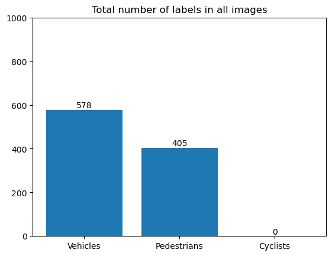
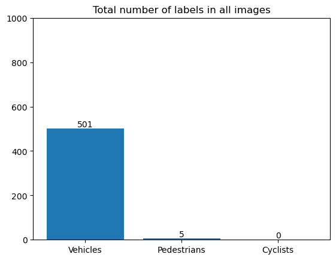
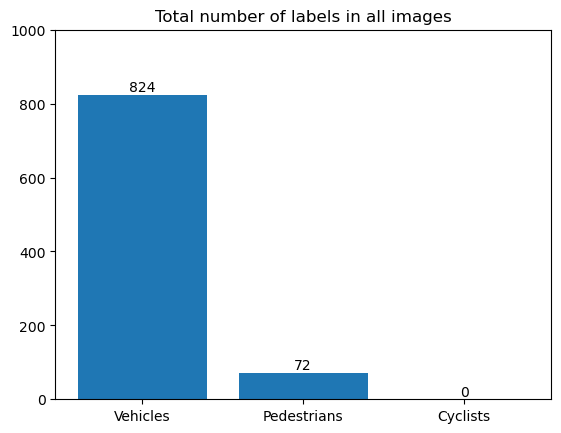
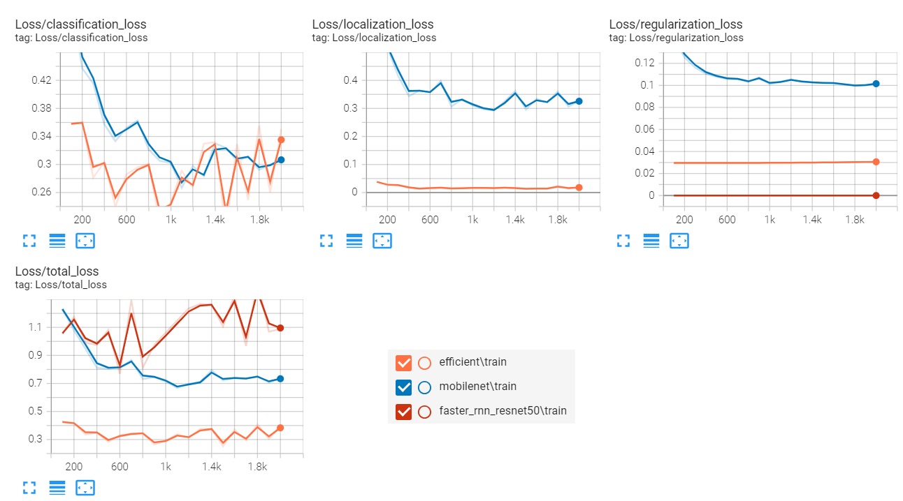

# Object detection in urban environment
## 1. Selection of pre-trained [models](https://github.com/tensorflow/models/blob/master/research/object_detection/g3doc/tf2_detection_zoo.md).
   This project use an object detection model with the Tensorflow Object Detection API and AWS Sagemaker.
   
| Pre-trained model from model zoo | Detectors Type |
| ------------- | ------------- | 
| EfficientDet D1 640x640  | One-stage |
| SSD MobileNet V2 FPNLite 640x640 | One-stage |
| Faster R-CNN ResNet50 V1 640x640 | Two-stage |
## 2. Dataset
Front Camera Images from [Waymo Open Dataset](https://waymo.com/open/). Data are in TFRecord Format. 
## 3. Parameters of traning
| Setting | EfficientDet D1 | MobileNet V2 | Faster R-CNN ResNet50 V1 |
| ------------- | ------------- | ------------- |  ------------- | 
| num_ephocs: |  2000 | 2000 | 2000 |
| optimizer: |   momentum_optimizer | adam_optimizer | momentum_optimizer|      
| learning_rate: |   cosine_decay_learning_rate | constant_learning_rate | cosine_decay_learning_rate|
| batch_size: | 8 | 8 | 8 |

**data_augmentation_options:** random_crop_image, random_horizontal_flip and random_scale_crop_and_pad_to_square.

## 4. Results with score more than 60%

| Models | Video | All frames | 
| ------------- | ------------- | ------------- | 
| EfficientDet D1 640x64  |  |   |
| SSD MobileNet V2 FPNLite 640x640 |  |  |
| Faster R-CNN ResNet50 V1 640x640 |  |  |

### Training loss results

## 5. Future training improvements
 **a. Increase the number of epochs:** It will lead to better training and convergence to smaller errors.
 
 **b. Change the optimizer:** Use in all experiments the ADAM optimizer that is mentioned in the literature as the optimizer with the best results.
 
 **c. Use other types of augmentation options:** Incorporate augmentations that improve the low lighting in the images.
